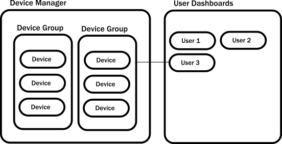

# Top-Level Architecture

- build a sample Akka.NET application to introduce the language of **actors** and how solutions can be formulated with them.
- It is a common [hurdle](عقبة) for beginners to translate their project into actors even though they don't understand what they do on the high-level.

- We will build the core logic of a small application and this will serve as a guide for common patterns that will help to **kickstart** Akka.NET projects.

- The application we aim to write will be a simplified **IoT system** where devices, installed at the home of users, can report **temperature** data from sensors.

- Users will be able to query the current state of these sensors.

- To keep things **simple**, we will not **actually expose** the application via **HTTP** or any other **external API** , we will, instead, concentrate only on the core logic.

- However, we will write tests for the pieces of the application to get comfortable and proficient with testing actors early on.

## Our Goals for the IoT System

- We will build a simple IoT application with the bare essentials to demonstrate designing an Akka.NET-based system.

- The application will consist of two main components:

  - **Device data collection**: This component has the responsibility to maintain a local representation of the otherwise remote devices. The devices will be organized into device groups, grouping together sensors belonging to a home.

  - **User dashboards**: This component has the responsibility to periodically collect data from the devices for a logged in user and present the results as a report.

- For simplicity, we will only collect temperature data for the devices, but in a real application our local representations for a remote device, which we will model as an actor, would have many more responsibilities.

- Among others; reading the configuration of the device, changing the configuration, checking if the devices are unresponsive, etc. We leave these complexities for now as they can be easily added as an exercise.

- We will also not address the means by which the remote devices communicate with the local representations (actors). 

- Instead, we just build an actor based API that such a network protocol could use. We will use tests for our API everywhere though.

- The architecture of the application will look like this:
  

